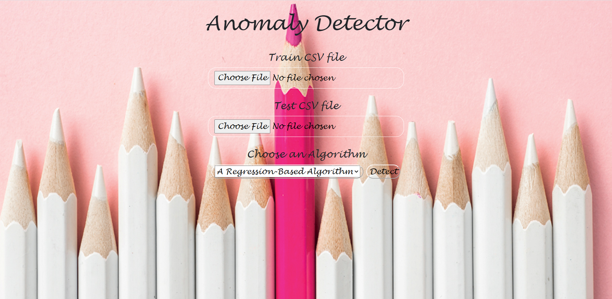

# Anomaly Detection Web Application

The project is a web application for anomalies detection, 
which was developed in JavaScript using Node.js and CSS.
The project is intended for a diverse audience of consumers such as regular users, 
automated services, etc.

The user opens a browser at 
``` localhost:8080 ```
, where he selects either regression-based or hybrid-based anomaly detection algorithm.
The user selects a Train CSV file to train the model with regular flight data, and another CSV file that may contain anomalies.
By clicking on the Detect button the files are transferred to the server.
The server detects the anomalies, and the output with the anomalies report appears on the same web page.

In addition, it is possible to send an HTTP POST to the same local address, 
where the command contains the selection of either one of the algorithms mentioned above and the two CSV files.
This way the user recieves a JSON which includes the anomalies report.

## Preparation
After downloading the project from github, please make sure you have installed:
* ``` node.js ``` version 14.16.1
* ``` express version ``` 4.17.1
* ``` express-fileupload ``` version 1.2.1
* ``` smallest-enclosing-circle ``` version 1.0.2
* ``` bodyparser ``` version 6.14.12

## The API:
* GET / - This path sends back index.html.
* POST /detect - This path receives request and response, where request is a data contains the train and test files and the algorithm type and the response is JSON of the anomalies

## Architecture
The architecture of the project is based on the MVC architecture.
* View: is an HTML web page, two fields for selecting files, select button and a table for displaying the output.
The controller instructs the view from where to pull the JSON and it in turn decodes and displays it.
* Controller: The controller uses the API.
When receiving the result, the controller convrets it to a JSON and instructs the view to create the desired output.
* Model: The model implements the algorithms, and returns the anomlies report.

## Functionality
On our web page, the first option is to select a Train CSV file, 
below it is the option to select a Test CSV file and finally you can choose which anomaly detection algorithm you want to use.

After uploading the files and selecting the algorithm, you can send your selections to the server by clicking the 'Detect' button.
If you want a new detection, select new files and a new anomaly detection algorithm and click the 'Detect' button again.

## Features
* Selecting an algorithm - the user may choose out of two algorithms which of the algorithms to use.
* Validation of the files - the user is allowed to upload only CSV files, and if either of the files are missing the user will recieve an appropriate message and the files will not be send to the server.
* Detect block - the user is not allowed to spam the server. the user must wait for the server to respond for each request whether it was successful or returned an error.
* Anomalies report - the user will see the anomalies report in a table in the web page.



## UML


## Video


## Developers
* Noam Basha
* Hanna Sofer
* Adi Ziv
* Noa Miara
